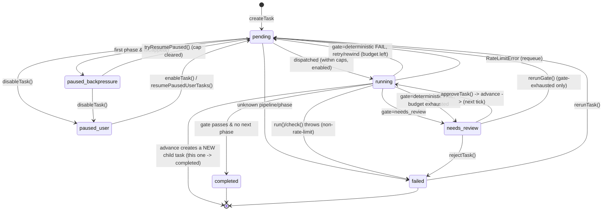

# Core 02 — The Task Lifecycle (State Machine)

A `Task` is a tiny state machine. Its position is `task.status` (one of the eight [`TaskStatus`](01-data-model.md) values) plus `task.phaseId` (which phase it's currently at). Every transition is driven by the [processor](03-processor.md) or by a handful of exported control functions (approve/reject/rerun/resume). This page maps the whole machine end to end so you can predict, from any state, what happens next.

> This page is the map. [03-processor.md](03-processor.md) is the territory (the actual tick loop), and [04-gates.md](04-gates.md) zooms into the gate transitions. Read this first.

---

## The states (recap)

| Status | Active? | Terminal? |
| --- | --- | --- |
| `pending` | waiting to be dispatched | no |
| `running` | being executed right now | no |
| `needs_review` | parked for the captain | no (needs a human action) |
| `paused_backpressure` | held back by backpressure | no (auto-resumes) |
| `paused_user` | manually disabled / batch-held | no (needs resume/enable) |
| `completed` | reached pipeline end | **yes** |
| `failed` | errored or rejected | terminal until `rerunTask` |
| `cleared_stale` | maintenance status, never set by core | (n/a) |

---

## State diagram



ASCII version of the happy path through a three-phase pipeline (phase A `auto_pass`, phase B `needs_review`, phase C `deterministic`):

```
createTask
   │
   ▼
[pending] ──dispatch──▶ [running A] ──auto_pass──▶ advance
                                                      │ creates child at phase B
                                                      ▼
                                                  [pending] ──dispatch──▶ [running B]
                                                                              │ needs_review gate
                                                                              ▼
                                                                       [needs_review]
                                                                              │ captain approveTask()
                                                                              ▼  advance, child at phase C
                                                                          [pending] ──▶ [running C]
                                                                                            │ deterministic check
                                                          pass ◀──────────────────────────┤
                                                            │                              │ fail (budget left)
                                                            ▼                              ▼
                                                  no next phase                     rewind to phase B
                                                            │                       [pending @ B] ...loop
                                                            ▼
                                                       [completed]
```

> **Important structural fact:** "advance" does **not** mutate the current task forward. The current task is set to `completed`, and a **new child task** is created at the next phase with `status: pending`. So a single pipeline run is a *chain of tasks*, each one completed, linked by `parentId`/`previousTaskId`. Only **rewind** moves the *same* task's `phaseId` (backward). Keep this distinction front of mind — it explains why the gate retry budget can't live on the task's own `retryCount`.

---

## Walking each transition

### 1. Creation → `pending`

`createTask` ([05-task-store.md](05-task-store.md)) writes `tasks/<id>/task.json` with `status: "pending"` (unless an explicit status is passed). New top-level work, single advances, and fan-out children all enter here.

```ts
// core/lib/tasks.ts:24-31
status: opts.status ?? "pending",
createdAt: nowIso(),
updatedAt: nowIso(),
attempts: [],
input: opts.input ?? {},
parentId: opts.parentId,
retryCount: 0,
```

### 2. `pending` → dispatch decision

Each `runProcessor()` tick gathers all `pending` tasks, **sorted by `createdAt` ascending (FIFO)**, and decides per task:

```ts
// core/lib/processor.ts:68-71
const allTasks = await listTasks();
const pending = allTasks
  .filter((t) => t.status === "pending")
  .sort((a, b) => a.createdAt.localeCompare(b.createdAt));
```

For each pending task, in order:

1. **Unknown pipeline/phase** → `fail(task, ...)` → `failed`.
2. **Pipeline disabled** (`isPipelineEnabled` false) → skipped, counted as `deferred`, **stays `pending`** so flipping the switch back resumes it.
3. **Over the per-tick cap** (per-pipeline `perTickCap`, else global) → `deferred`, stays `pending`.
4. **First phase AND `isCapped()`** → set `paused_backpressure`.
5. Otherwise → added to the dispatch list and later set `running` inside `runPhase`.

### 3. `pending` → `paused_backpressure`

Backpressure protects the captain from drowning in `needs_review` tasks. Only **first-phase** tasks can be paused this way; mid-pipeline tasks always run so in-flight work drains.

```ts
// core/lib/processor.ts:113-119
if (isFirstPhase(pipeline, phase.id) && (await isCapped(pipeline))) {
  await updateTask(task.id, { status: "paused_backpressure" });
  result.paused++;
  ...
}
```

`isCapped` counts `needs_review` tasks in the pipeline against `backpressureCap` (default 5):

```ts
// core/lib/processor.ts:162-167
const cap = pipeline.backpressureCap ?? DEFAULT_BACKPRESSURE_CAP;
const inPipeline = await listTasksByPipeline(pipeline.id);
const needsReviewCount = inPipeline.filter((t) => t.status === "needs_review").length;
return needsReviewCount >= cap;
```

### 4. `paused_backpressure` → `pending` (auto-resume)

**Step 1 of every tick**, *before* dispatch, `tryResumePaused()` flips paused-backpressure tasks back to `pending` once the cap clears (i.e. the captain reviewed enough tasks):

```ts
// core/lib/processor.ts:144-159
const paused = all.filter((t) => t.status === "paused_backpressure");
...
if (!(await isCapped(pipeline))) {
  await updateTask(t.id, { status: "pending" });
  resumed++;
  ...
}
```

Resume requires the pipeline to be enabled. Resumed tasks just rejoin the FIFO queue and may or may not dispatch the same tick.

### 5. `pending` → `running` → the phase runs

`runPhase` flips the task to `running`, runs `phase.run()` if present (writing output to disk and onto the task), then calls `applyGate`:

```ts
// core/lib/processor.ts:169-192
await updateTask(task.id, { status: "running" });
...
if (phase.run) { ... output = result.output; ... }
await updateTask(task.id, { output });
await applyGate(pipeline, phase, task, startedAt);
```

### 6. The gate fork (`running` → ?)

`applyGate` branches on `phase.gateType`. Full detail in [04-gates.md](04-gates.md); the transitions are:

- **`needs_review`** → append `ok` attempt, set `needs_review`. Stops here for the captain.
- **`auto_pass`** → append `ok` attempt, `advanceOrComplete`.
- **`deterministic`** → run `check()`:
  - **pass** → `ok` attempt, `advanceOrComplete`.
  - **fail, budget left, has previous phase** → rewind: same task back to `previousPhase`, `status: pending`, carrying `input.gateRetryCount`+`gateRetryFeedback`, and `clearFailureAttempts`.
  - **fail, budget left, no previous phase** → in-place retry: `status: pending`, bump `retryCount`.
  - **fail, budget exhausted** → run `onExhausted()` hook, then `needs_review` with `gateFailReason` set.

### 7. `running` → `completed` or new child (advance)

`advanceOrComplete` decides the forward step:

```ts
// core/lib/processor.ts:306-313
const next = nextPhase(pipeline, phase.id);
if (!next) {
  await updateTask(task.id, { status: "completed" });
  ...
  return;
}
```

- **No next phase** → `completed`. Terminal.
- **Has next phase, no `fanOut`** → create one child task at `next` (`pending`), then set the current task `completed`.
- **Has next phase, `fanOut`** → call `fanOut(task)`:
  - empty array → current task `completed` (`fanout_empty`).
  - N elements → create N children at `next`; first `fanOutBatchSize` go `pending`, the rest `paused_user`; current task `completed`.

### 8. `running` → `pending` (rate-limit requeue)

If `run()`/`check()` throws a `RateLimitError` ([06-claude-wrapper.md](06-claude-wrapper.md)), the task is **not** failed — it's put back to `pending` so a later tick retries when the limit clears:

```ts
// core/lib/processor.ts:196-203
if (err instanceof RateLimitError) {
  await updateTask(task.id, { status: "pending" });
  ...
  return;
}
await fail(task, msg);
```

Any other throw → `fail` → `failed`.

### 9. `needs_review` → captain actions

The captain acts via exported functions (called from the dashboard API, see [`../dashboard/03-api-endpoints.md`](../dashboard/03-api-endpoints.md)):

- **`approveTask(id)`** → `advanceOrComplete` (so → `completed` or a new child at `pending`). **Refuses** if it's a deterministic gate with `gateFailReason` set (throws "cannot approve past failed … gate"). See [04-gates.md](04-gates.md).
- **`rejectTask(id, reason)`** → `failed` with the reason.
- **`rerunGate(id)`** → only for gate-exhausted tasks (`gateFailReason` set). Rewinds to the previous phase, `pending`, clears the gate-fail attempts so the gate gets a fresh budget.

### 10. `failed` → `pending` (rerun)

`rerunTask(id)` re-queues a failed task: `pending`, clears `error`/`retryCount`/`gateFailReason`, and `clearFailureAttempts`. The `ok` attempt history survives.

```ts
// core/lib/processor.ts:502-511
if (!task || task.status !== "failed") return null;
await updateTask(task.id, {
  status: "pending", error: "", retryCount: 0, gateFailReason: "",
});
await clearFailureAttempts(task.id);
```

### 11. `pending`/`paused_backpressure` → `paused_user` and back

`disableTask` lets the captain take a not-yet-running task out of play by reusing `paused_user`; `enableTask`/`resumePausedUserTasks` bring it back to `pending`. Fan-out batching *also* uses `paused_user` for held-back children.

```ts
// core/lib/processor.ts:431-438
if (task.status !== "pending" && task.status !== "paused_backpressure") return task;
await updateTask(task.id, { status: "paused_user" });
```

---

## Invariants worth trusting

- A task in `running` is always mid-tick; if the process dies there, the `task.json` stays `running` and nothing auto-recovers it (no orphan sweep exists in core). You'd `rerunTask` won't help — it requires `failed`; you'd flip it manually or restart the work.
- `completed` and `failed` are the only states the processor's dispatch loop never picks up.
- `createdAt` is immutable, so FIFO order is stable across rewinds and retries (a rewound task keeps its original `createdAt` and thus its queue position).

---

## Where to go next

- [03-processor.md](03-processor.md) — the tick loop and every exported control function.
- [04-gates.md](04-gates.md) — the gate fork in full, including the rewind/retry-budget design.
- [01-data-model.md](01-data-model.md) — the field definitions referenced above.
